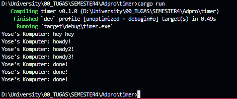
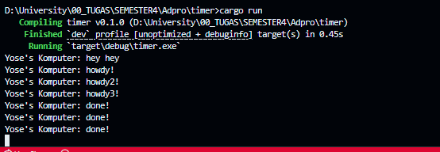

# Reflection 

## 1.2 Understanding how it works. 


```rust
fn main() {
    let (executor, spawner) = new_executor_and_spawner();

    spawner.spawn(async {
        println!("Yose's Komputer: howdy!");
        TimerFuture::new(Duration::new(2, 0)).await;
        println!("Yose's Komputer: done!");
    });
    println!("Yose's Komputer: hey hey");
    drop(spawner);

    executor.run();
}
```

`main()` spawned an async task by `spawner.spawn`. But this task isn't executed yet, it's scheduled. Then, the code executes `print("hey hey")`, after that the spawner is dropped and finally `executer.run()` is called which starts processing the queued async task. The async tasks aren't executed immediately when spawned, they only run when the executor processed them. 

## 1.3 Experiment 1.3: Multiple Spawn and removing drop

**with drop**


**without drop**


`Executor::run()` method contains a loop that keeps running as long as it receive tasks. But when the spawners are dropped, when all pending tasks are processed, it will return an `Err` causing the executor to exit its loop and terminate. 

Without drop, the executor would keep running indefinitely waiting for the new tasks. But using drop, once all tasks are completed, the executor cleanly terminates and the program exits naturaly. 