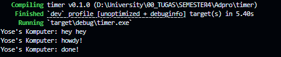

# Reflection 

## 1.2 Understanding how it works. 



```rust
fn main() {
    let (executor, spawner) = new_executor_and_spawner();

    spawner.spawn(async {
        println!("Yose's Komputer: howdy!");
        TimerFuture::new(Duration::new(2, 0)).await;
        println!("Yose's Komputer: done!");
    });
    println!("Yose's Komputer: hey hey");
    drop(spawner);

    executor.run();
}
```

`main()` spawned an async task by `spawner.spawn`. But this task isn't executed yet, it's scheduled. Then, the code executes `print("hey hey")`, after that the spawner is dropped and finally `executer.run()` is called which starts processing the queued async task. The async tasks aren't executed immediately when spawned, they only run when the executor processed them. 

